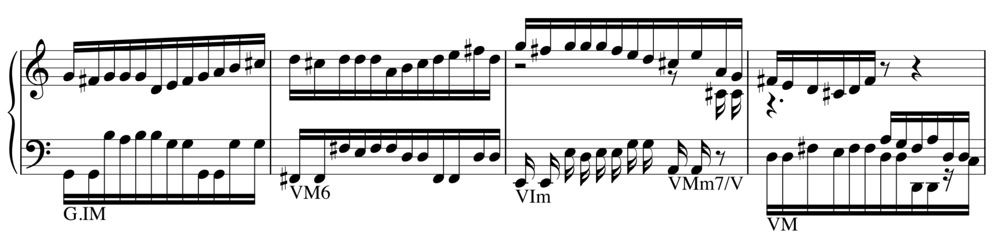

This module ports MusicBERT to HuggingFace and provides some token classification models that can be used for tasks like Roman Numeral analysis and other music theory tasks.

The most important contents of this module are the following:

1. A `huggingface` implementation of MusicBERT, `MusicBert`.
2. Several subclasses of MusicBERT that can be used for token-level tasks like Roman-numeral analysis: `MusicBertTokenClassification`, `MusicBertMultiTaskTokenClassification`, and `MusicBertMultiTaskTokenClassConditioned`.
3. Functions to load the above classes from MusicBERT `fairseq` checkpoints. `fairseq` is the library of the original MusicBERT implementation, and also the library in which that I did the training described in [my 2024 ISMIR paper](https://malcolmsailor.com/2025/01/06/ISMIR.html) and in my upcoming dissertation.
4. `scripts/finetune.py`, a script to fine-tune token-classification models like the ones I use in my dissertation.
5. `scripts/predict.py`, a script that runs Roman-numeral prediction on a MIDI file.

If you want to fine-tune MusicBERT on a token classification task or make use of RNBert yourself, I would suggest using the code in this repository, since HuggingFace is an actively maintained library. On the other hand, to reproduce the results reported in [my 2024 ISMIR paper](https://malcolmsailor.com/2025/01/06/ISMIR.html), you'll want to run the scripts in [the FairSEQ implementation of RNBert](https://github.com/malcolmsailor/rnbert).

Trained weights for RNBert are also available from the [HuggingFace hub](https://huggingface.co/msailor/rnbert_weights). See below.


# Examples

## Load MusicBERT from scratch

```python
import torch
from musicbert_hf import MusicBert, MusicBertConfig

config = MusicBertConfig()  # Set parameters as needed
model = MusicBert(config)

# Note that attention_mask is 1/8th the length of input_ids
model(input_ids=torch.randint(0, 10, (2, 800)), attention_mask=torch.ones(2, 100))
```

## Load MusicBERT with pretrained weights

There's two possibilities.

1. You have a model pre-trained with FairSEQ, like the original MusicBERT, whose checkpoint you can download from [https://1drv.ms/u/s!Av1IXjAYTqPsuBaM9pZB47xjX_b0?e=wg2D5O](https://1drv.ms/u/s!Av1IXjAYTqPsuBaM9pZB47xjX_b0?e=wg2D5O).

```python
from musicbert_hf.checkpoints import load_musicbert_from_fairseq_checkpoint

model = load_musicbert_from_fairseq_checkpoint("path/to/checkpoint.pt")
```

2. You have a checkpoint pre-trained with the model classes from this repository, in which case you can simply do

```python
from musicbert_hf import MusicBertTokenClassification

MusicBertTokenClassification.from_pretrained("path/to/checkpoint/directory")
```

## Load a token classifier initialized with MusicBERT, suitable for fine-tuning

```python
from musicbert_hf.checkpoints import (
    load_musicbert_token_classifier_from_fairseq_checkpoint,
)

model = load_musicbert_token_classifier_from_fairseq_checkpoint(
    "path/to/checkpoint.pt",
    checkpoint_type="token_classifier",
    num_labels=42,  # Set number of output labels according to your task
)
```

## Run the fine-tuning script

First install the requirements (e.g., do `pip install .[finetune]` when in the repository root folder).

Then compile data into the expected format, described in the docstring for `scripts/finetune.py`. The script I used for this purpose is `scripts/data_preprocessing.py`, which itself expects CSV files as input (see the docstring for that file), but you can also write your own script for this purpose.

Then do something like

```bash
python scripts/finetune.py \
    data_dir=/path/to/input/data \
    output_dir_base=/path/to/save/to \
    targets='[target,or,list,of,target,names]' \
    checkpoint_path=/path/to/checkpoint
```

Any unrecognized CLI args of format `key=value` are passed through to the [`TrainingArguments`](https://huggingface.co/docs/transformers/en/main_classes/trainer#transformers.TrainingArguments) class that configures the fine-tuning. For example, you could add `eval_steps=1000` to the above command.

## Run the prediction script

First install the requirements (e.g., do `pip install .[predict]` when in the repository root folder).

Then save a config file according to the description in the docstring for `scripts/predict.py`, and run the script in the following manner:

```bash
python scripts/predict.py \
    --config /path/to/config.json \
    [--input-path /path/to/input.mid] \
    [--output-folder /path/to/output_folder]
```

The script will save the logits and vocabulary for each predicted feature to the output folder. It will also save two CSV files, `annotated_music_df.csv`, which contains the (salami-sliced, quantized, dedoubled) notes of the score annotated with the harmonic analysis annotations, and `chord_df.csv` which contains only the harmonic analysis annotations. Finally, if `make_pdf` is true, it will save an annotated PDF of the score as `annotated.pdf`.

To run with fine-tuned RNBert checkpoints, run `python supporting_files/download_rnbert_weights.py` and then run

```bash
python scripts/predict.py \
    --config supporting_files/rnbert_config.json \
    [--input-path /path/to/input.mid] \
    [--output-folder /path/to/output_folder]
```



If you want to view the output as a PDF (similar to the above screenshot), there are a number of external dependencies that must be in the path:

- [humdrum-tools](https://github.com/humdrum-tools/humdrum-tools)
- [verovio](https://github.com/rism-digital/verovio)
- [img2pdf](https://pypi.org/project/img2pdf/)
- [rsvg-convert](https://manpages.ubuntu.com/manpages/trusty/man1/rsvg-convert.1.html)

Then set the `make_pdf` configuration field to true. Note that the version of the score displayed in the PDF will be the score as seen by the model, which is salami-sliced, dedoubled, and quantized.
